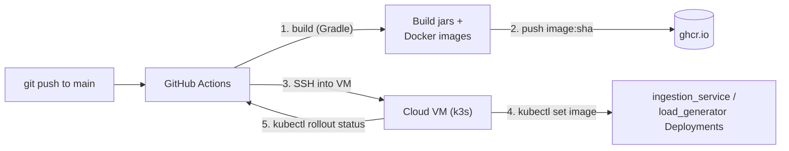

# Fleet Telemetry Ingestion System — CD Pipeline

## Status
Draft — iterative, in progress. Builds on [spec.md](spec.md) and
[implementation-spec.md](implementation-spec.md).

## 1. Purpose

Define how a `git push` to GitHub results in `ingestion_service` and
`load_generator` running on a k3s cluster on a cloud VM (simple VPS —
DigitalOcean/Hetzner/Linode-class). `kafka` is not part of this pipeline —
it's deployed once via Helm as part of cluster bootstrap (see §6), not
redeployed on every app push.

## 2. Environments

- **Local (k3d):** unchanged, still used for dev/iteration, per
  implementation-spec.md.
- **Cloud VM (k3s):** a separate, standing deployment — a single VM running
  k3s, kept up to date by this CD pipeline. Same `fleet-ingestion` namespace
  and component design as local; only the deployment mechanism differs.

## 3. Pipeline Overview



Trigger: **push to `main`**, fully automatic (build → push → deploy, no
manual approval step).

## 4. GitHub Actions Workflow

Single workflow, two jobs:

**Job 1 — `build-and-push`** (matrix over `ingestion_service`,
`load_generator`):
1. Checkout code.
2. Build with Gradle.
3. Build Docker image.
4. Tag image as `ghcr.io/<owner>/<repo>/<service>:<git-short-sha>`.
   - **Tag = git short SHA, not `latest`.** `kubectl set image` needs a
     distinct tag to trigger a rollout; reusing `latest` wouldn't reliably
     trigger a new pod rollout without extra `imagePullPolicy`/rollout-restart
     handling. Immutable SHA tags also make it obvious which commit is
     running.
5. Push to GHCR, authenticated via the workflow's built-in `GITHUB_TOKEN`
   (no separate registry credentials needed for pushing).

**Job 2 — `deploy`** (runs after Job 1 succeeds for both services):
1. SSH into the cloud VM (credentials via GitHub Secrets — see §5).
2. Run, for each service:
   ```
   kubectl set image deployment/ingestion-service \
     ingestion-service=ghcr.io/<owner>/<repo>/ingestion-service:<sha> \
     -n fleet-ingestion
   kubectl set image deployment/load-generator \
     load-generator=ghcr.io/<owner>/<repo>/load-generator:<sha> \
     -n fleet-ingestion
   ```
3. Run `kubectl rollout status deployment/<name> -n fleet-ingestion` for
   each, so the workflow fails visibly if the new pods don't come up
   healthy (backed by the Actuator health checks from
   implementation-spec.md §10).

## 5. Secrets & Access

GitHub Actions needs, as repository secrets:
- `DEPLOY_SSH_KEY` — private key for SSH access to the VM.
- `DEPLOY_HOST` — VM address.
- `DEPLOY_USER` — SSH user on the VM.

`kubectl` runs **on the VM itself** (over the SSH session) against its own
local k3s, using the VM's existing kubeconfig — no kubeconfig is transferred
from GitHub Actions. Pushing to GHCR uses the workflow's own `GITHUB_TOKEN`,
not a separate secret.

GHCR packages are **public**, so no `imagePullSecret`/registry
authentication is needed on the VM's k3s to pull images.

## 6. Cluster Bootstrap (one-time, not part of this pipeline)

The VM needs to already have, before this pipeline can deploy anything:
- k3s installed
- `fleet-ingestion` namespace created
- `kafka` deployed via Helm (per implementation-spec.md §4) and its topic
  created
- `ingestion_service`/`load_generator` Deployments + Services created at
  least once (so `kubectl set image` has something to update)

This is **manual, run via `Makefile` targets** — not part of the GitHub
Actions pipeline, and not further automated (no Terraform/Ansible) at this
stage. Only needs to happen once per VM, unlike the app deploy which happens
on every push. Indicative targets, run by hand from a developer machine with
SSH/kubeconfig access to the VM:
- `make bootstrap` — installs k3s (if not already), creates the
  `fleet-ingestion` namespace, installs the Kafka Helm chart, runs the topic
  creation Job.
- `make deploy-init` — applies the initial `Deployment`/`Service` manifests
  for `ingestion_service` and `load_generator`, so subsequent CD pushes have
  something to `kubectl set image` against.

## 7. Rollback

**Manual, via a `Makefile` target** — no automatic rollback-on-failure in
the pipeline. If a deploy misbehaves:
- `make rollback SERVICE=ingestion-service` — runs
  `kubectl rollout undo deployment/ingestion-service -n fleet-ingestion`
  (and equivalent for `load-generator`).

The GitHub Actions `deploy` job still fails visibly on a bad rollout (via
`kubectl rollout status`, per §4), so a failed deploy is always noticed —
recovery from it is just a manual, deliberate step rather than automatic.

## 8. Open Questions

None currently. New questions will be added here as they come up in later
iterations.
