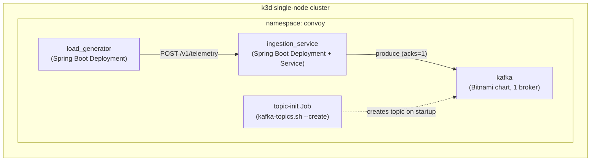

# Convoy — Low-Level Design & Implementation

## Status
Draft — iterative, in progress. Builds on [spec.md](spec.md).

## 1. Purpose

Concrete, buildable design for running the ingestion boundary
(`load_generator` → `ingestion_service` → `kafka`) inside a single k3s
cluster running locally (k3d, single node). Additional components
(enrichment, DB persistence, their consumers) will be added in later
iterations, as separate components alongside these three.

## 2. Deviations from spec.md

The high-level spec (spec.md §6) assumed a multi-broker Kafka setup with
replication factor 3, sized for a production-like self-hosted deployment.
Running on a single-node local k3d cluster changes that:

- **Kafka: 1 broker, replication factor 1.** No broker-failure durability.
  This is an accepted trade-off for a local/portfolio environment — not a
  correction to the target design, just a documented divergence for this
  environment. Partition count stays at **12** as originally specified
  (partition count is independent of broker count/RF).
- Everything else in spec.md (topic name, partition key, retention,
  API contract, response codes, data model) is unchanged.

## 3. Cluster Topology

- **Cluster:** k3d, single node, local machine.
- **Namespace:** `convoy` — all three components deployed here.
- **Components (this iteration):**
  - `kafka` — Bitnami Kafka Helm chart, 1 broker
  - `ingestion_service` — Spring Boot REST API, Kafka producer
  - `load_generator` — Spring Boot app simulating the vehicle fleet
- Components address each other via in-cluster k8s Service DNS
  (`<service>.convoy.svc.cluster.local`), no ingress/external
  exposure needed at this stage since the load generator is in-cluster too.

## 4. Component: kafka

- **Deployment:** Bitnami Kafka Helm chart.
- **Key values overrides:**
  - `replicaCount: 1`
  - `persistence.size: 2Gi` — sized for 3h retention at ~1K events/sec of
    small JSON events, confirmed.
  - `resources`: see §9 for the cluster-wide resource budget and per-pod
    split
  - **Mode: KRaft** (no Zookeeper) — simpler footprint for a single-node
    dev cluster.
- **Topic creation:** explicit, not auto-created. A one-off Kubernetes `Job`
  (using the Bitnami Kafka image's `kafka-topics.sh`) runs after the Kafka
  pod is ready and creates:
  ```
  kafka-topics.sh --create \
    --topic vehicle.telemetry.raw \
    --partitions 12 \
    --replication-factor 1 \
    --bootstrap-server kafka.convoy.svc.cluster.local:9092
  ```
  This keeps topic config (partitions, RF) explicit and versioned rather than
  relying on broker defaults.

## 5. Component: ingestion_service

- **Stack:** Java, Spring Boot, Spring Web (servlet/MVC — simplest fit for a
  synchronous "validate → produce to Kafka → return 202" request, no need
  for reactive/WebFlux at this scale).
- **Responsibilities:** implements the REST contract from spec.md §5
  exactly — `POST /v1/telemetry`, 202/400/503, synchronous Kafka produce
  with `acks=1`.
- **Kafka client:** Spring Kafka (`KafkaTemplate`), producer `acks=1`,
  `client-id` and `bootstrap-servers` pointing at the in-cluster Kafka
  Service DNS.
- **Validation:** Bean Validation (`jakarta.validation`) on the request DTO
  matching the data model in spec.md §4 (vehicle_id, driver_id, timestamp,
  latitude, longitude, speed_kph, heading_deg).
- **Config:** `application.yaml` with Kafka bootstrap servers and topic name
  externalized (overridable via env vars / k8s ConfigMap), not hardcoded.
- **Container image:** multi-stage Dockerfile — Gradle build in a builder
  stage, run on `eclipse-temurin:21-jre-alpine` (Java 21 LTS).
- **K8s manifests:** `Deployment` (1 replica) + `Service` (ClusterIP) in the
  `convoy` namespace. Resource requests/limits: see §9.

## 6. Component: load_generator

- **Stack:** Java, Spring Boot (same stack as ingestion_service, per your
  earlier choice, for consistency).
- **Purpose:** simulate ~10,000 vehicles, each posting a telemetry event
  every 10 seconds to `ingestion_service`'s `POST /v1/telemetry` — i.e.,
  reproduce the ~1,000 events/sec sustained load from spec.md §3.
- **Approach:** an in-process pool of virtual vehicles (simple scheduled
  loop per vehicle or a shared scheduler driving all vehicles), each with a
  stable `vehicle_id`/`driver_id` and evolving lat/long/speed/heading, each
  posting independently to the ingestion_service Service DNS.
- **Config (externalized, not hardcoded):** vehicle count, ping interval,
  target ingestion_service URL — via `application.yaml`/env vars, so load
  can be tuned without a rebuild.
- **Deployment shape:** single pod for now — sufficient to generate
  ~1,000 events/sec from one JVM; can be scaled to multiple replicas later
  if a single pod can't sustain the load. Not a Job (long-running, continuous
  generation), a `Deployment`. Build/base image: same as ingestion_service
  (Gradle build, `eclipse-temurin:21-jre-alpine`). Resources: see §9.
- **Out of scope for load_generator:** no assertions/verification of
  results — it only generates load. Verifying ingestion behavior end-to-end
  (success rates, latency, observability) is deferred to a later iteration
  — see §8.

## 7. Diagram



## 9. Resource Budget

The original estimate here was a k3d node sized at 2 vCPU / 4GB RAM, covering
only kafka + the two app services. That no longer reflects reality: Kafka's
JVM heap was later pinned explicitly (see infra/kafka/values.yaml) and the
observability stack (infra/observability/values.yaml — Prometheus, Grafana,
kube-state-metrics, node-exporter) was added on top, with no headroom left
for it on the original 4GB budget. Current limits, summed from the actual
Helm values in the repo:

**App services:**

| Component | CPU request | CPU limit | Mem request | Mem limit |
|---|---|---|---|---|
| kafka (1 broker, KRaft) | 500m | 1000m | 1Gi | 1536Mi |
| ingestion_service | 250m | 500m | 512Mi | 768Mi |
| load_generator | 250m | 500m | 512Mi | 768Mi |

**Observability stack:**

| Component | CPU request | CPU limit | Mem request | Mem limit |
|---|---|---|---|---|
| prometheus | 200m | 500m | 512Mi | 768Mi |
| prometheusOperator | 100m | 200m | 128Mi | 256Mi |
| grafana | 100m | 200m | 150Mi | 640Mi |
| kube-state-metrics | 50m | 100m | 64Mi | 128Mi |
| node-exporter | 50m | 100m | 32Mi | 64Mi |

| | CPU limit | Mem limit |
|---|---|---|
| **Total (all components)** | **~3100m** | **~4.8Gi** |

That total doesn't include k3s system components (containerd, kube-proxy,
coredns, kubelet, metrics-server), which need their own headroom on top —
roughly 1 vCPU / 1Gi based on the margin the original budget reserved for
them.

**Node sizing: 4 vCPU / 8GB RAM**, to give ~1 vCPU and ~3Gi of real headroom
above the current sum of limits. See docs/cd-pipeline-spec.md §2 for the
cloud VM this maps to. If pods get OOMKilled or throttled in practice, these
numbers should be revisited — they're sized from configured limits, not a
benchmarked load test.

## 10. Verification / Observability

- **Logs:** standard application logs (stdout, captured via `kubectl logs`)
  from `ingestion_service` and `load_generator` — request/produce success
  and error logging at minimum.
- **Actuator:** Spring Boot Actuator enabled on both apps (`/actuator/health`,
  `/actuator/metrics`) for basic liveness/readiness and in-process metrics.
  Not wired to k8s probes yet — that's part of implementation, not this
  design pass.
- **Deferred:** OpenTelemetry (traces/metrics export) — will be added in a
  later iteration, not in this one.

## 11. Open Questions

None currently. New questions will be added here as they come up in later
iterations.
