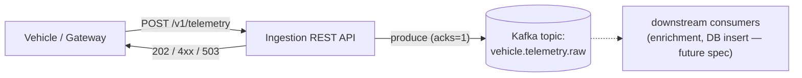

# Fleet Telemetry Ingestion System — Specification

## Status
Draft — iterative, in progress.

## 1. Use Case

A fleet of ~10,000 transport vehicles moving across a continent periodically
reports telemetry (geolocation, velocity, and related data) to a central
system via REST API. This document specifies the **ingestion boundary**:
receiving that data over HTTP and reliably handing it off to a queue for
downstream processing (enrichment, DB persistence — out of scope here, covered
in a future spec).

## 2. Scope

**In scope:**
- REST API contract for vehicles/devices to POST telemetry
- Validation and acceptance behavior at the API layer
- Handoff to Kafka (topic design, partitioning, delivery guarantees)

**Out of scope (future spec):**
- Enrichment logic
- Database schema and insert path
- Consumers of the Kafka topic

## 3. Assumptions

- **Scale:** ~10,000 vehicles, each reporting ~1 ping every 10 seconds →
  ~1,000 events/sec sustained, with bursts (e.g., reconnect storms after
  network gaps) assumed but not yet quantified.
- **Transport:** Devices/gateways call a REST API directly (not MQTT or other
  IoT protocols) — per your description of "REST API POST calls."
- **Queue:** Kafka, self-hosted.
- **Payload:** One event per vehicle per POST, no client-side batching.
- **Auth:** None for now (open to revisit before production).
- **Retention:** 3 hours on the Kafka topic — a safety margin for brief
  consumer downtime/deploys, not a long-term store or replay log.

## 4. Data Model

Minimal telemetry event covering what's confirmed so far. This is expected to
grow — more fields (e.g., fuel level, engine diagnostics, odometer) will be
added in a later iteration.

```json
{
  "vehicle_id": "string",       // unique vehicle identifier
  "driver_id": "string",        // current driver identifier
  "timestamp": "string",        // ISO 8601, event time (device clock)
  "latitude": "number",
  "longitude": "number",
  "speed_kph": "number",
  "heading_deg": "number"       // optional, 0-359
}
```

## 5. REST API Contract

```
POST /v1/telemetry
Content-Type: application/json

Body: single telemetry event (see §4)

Responses:
  202 Accepted        — event validated and handed to queue
  400 Bad Request      — schema validation failed
  503 Service Unavailable — queue unreachable, client should retry
```

No authentication for now (see §3). No client-side batching — one event per
request. No dedup: duplicate events (e.g., from client retries) are accepted
and queued as-is; not handled at this stage.

Design notes:
- **202, not 200/201** — the API's job ends at "accepted into the queue," not
  "fully processed." This matches the ingestion-only scope.
- **Synchronous produce-to-Kafka**: the API waits for a Kafka ack (`acks=1`
  minimum) before returning 202, so a 202 means the event is durably queued,
  not just received in memory. This is the simplest correct option at this
  scale; async fire-and-forget would risk silent data loss and isn't needed
  to hit ~1K events/sec.
- No batching endpoint for now — one event per request, matching the
  assumption in §3. Revisit if per-request overhead becomes a bottleneck.

## 6. Queue Design (Kafka)

- **Topic:** `vehicle.telemetry.raw` — single topic for now. No per-region or
  per-fleet topic split; not justified at this scale.
- **Partition key:** `vehicle_id` — guarantees per-vehicle event ordering
  (important for a moving object's track) while spreading load across
  partitions. Only per-vehicle ordering is required — no global ordering
  across vehicles.
- **Partition count:** 12. At ~1,000 events/sec of small JSON payloads,
  throughput per partition is not the constraint — this is sized for consumer
  parallelism headroom (up to 12 consumer instances in a group) and gives
  room for several times the current fleet size before repartitioning is
  needed. Revisit if actual message size or fleet growth projections say
  otherwise.
- **Replication factor:** 3 (standard durability default for self-hosted
  Kafka; avoids data loss on broker failure).
- **Retention:** 3 hours. This is a short-term buffer against consumer
  downtime/deploys, not a replay/backfill store — if downstream consumers
  fall behind by more than 3 hours, data is lost. Flagging this as a risk to
  confirm is acceptable given the "ingestion + queue only" scope.

## 7. Open Questions (remaining)

None currently — all prior open questions resolved (see §3, §4, §6, §9).
New questions will be added here as they come up in later iterations.

## 8. Diagram



## 9. Non-Functional Requirements (draft)

| Aspect | Target | Notes |
|---|---|---|
| Sustained throughput | ~1,000 events/sec | Per §3 assumption |
| API latency (p99) | 3 sec | Time to return 202, including Kafka `acks=1` round-trip |
| Durability (in Kafka) | No data loss once 202 returned, for up to 3h of consumer downtime | Backed by `acks=1` + replication factor 3 + 3h retention |
| Availability | Single region | No cross-region failover in this design |
